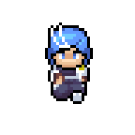

# Elements - Action RPG Game

O jogo Elements é um game de action rpg que está sendo desenvolvido na Godot Engine, é o primeiro projeto de jogos feito por AlphaDX e Tofim.

## Resumo do jogo
No reino de Elementaria, onde as pessoas tem poderes elementais, o jovem Robson sonha em se tornar um conjurador de elementos, ele é aprendiz de Cleiton, um mestre conjurador renomado e agora aposentado.
Robson seguia o seu treinamento com Cleiton até que um dia, um evento estranho aconteceu sob os céus de Elementaria e, misteriosamente, pessoas começaram a ser possuídas por um elemento desconhecido. Sabendo deste evento incomum, Cleiton decide partir pelo reino em busca de respostas mas desaparece durante suas explorações.
Agora, Robson precisa ir em busca de Cleiton para descobrir o seu paradeiro e desvendar os mistérios do tal elemento desconhecido.

## Plataforma
PC (Windows e Linux)

## Gráficos
2D, Pixel Art
